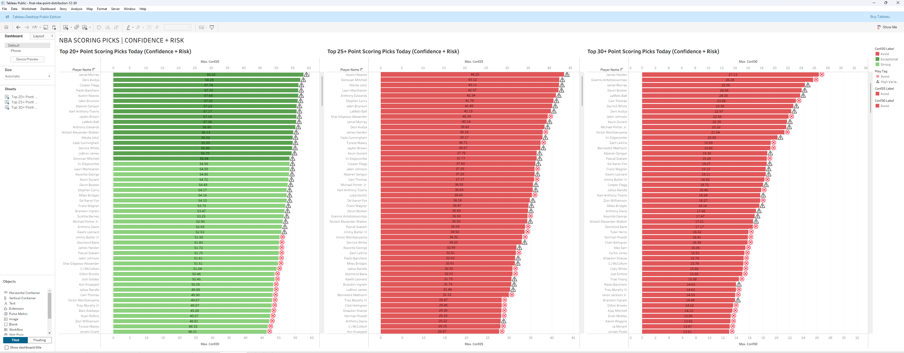

# NBA Points Distribution & Daily Scoring Confidence

A data pipeline and probabilistic modeling project that generates **daily NBA player scoring projections** and **confidence scores** for common point thresholds (20+, 25+, 30+), with results exported to CSV and visualized in Tableau.

Rather than predicting a single point total, this project models the **full distribution of scoring outcomes** and translates that uncertainty into actionable confidence and risk signals.

---

## Project Overview

Each day, the system:

1. Ingests NBA game and player box score data into PostgreSQL  
2. Builds rolling player features based on recent performance and usage  
3. Estimates a probabilistic scoring distribution for each player  
4. Computes probabilities and confidence scores for scoring thresholds  
5. Writes daily predictions to a database table  
6. Exports a clean UTF-8 CSV for Tableau dashboards  

The result is a **daily ranked list of players** showing:
- how strong the scoring edge is
- how risky or volatile that edge may be

---

## Key Outputs

### Expected value and uncertainty
- **`mu_pts`**: expected points scored
- **`sigma_pts`**: uncertainty (volatility) of scoring outcomes

Two players can have similar expected points but very different risk profiles.

---

### Threshold probabilities
- **`P20`**: probability of scoring at least 20 points
- **`P25`**: probability of scoring at least 25 points
- **`P30`**: probability of scoring at least 30 points

---

### Confidence scores
- **`Conf20`**, **`Conf25`**, **`Conf30`** are risk-adjusted signals that combine:
  - probability of clearing the threshold
  - uncertainty in the underlying distribution

Higher confidence does not always mean lower risk.

---

## Visualization Layer (Tableau)

The Tableau dashboard separates **edge strength** from **risk**:

- **Bars** represent confidence score magnitude
- **Icons** represent risk classification:
  - Lock: lower variance, cleaner profile
  - Warning: higher variance
  - X: avoid

This allows the viewer to distinguish between:
- the player most likely to hit a threshold
- the player with the safest outcome distribution

---

## Project Structure

├─ src/
│ ├─ ingest_yesterday.py
│ ├─ backfill_games.py
│ ├─ ingest_roster.py
│ ├─ build_features.py
│ ├─ train_model.py
│ ├─ score_today.py
│ ├─ score_historical.py
│ ├─ run_daily.py
│ ├─ db.py
│ └─ config.py
├─ sql/
│ ├─ schema.sql
│ └─ player_features_daily.sql
├─ requirements.txt
└─ README.md


---

## Data Storage

PostgreSQL tables include:
- `games`
- `players`
- `player_game_stats`
- `player_features_daily`
- `predictions_daily`

The Tableau dashboard is driven by the `predictions_daily` table.

---

## How to Run

### Install dependencies
```
pip install -r requirements.txt
```

### Configure environment
Set database credentials as environment variables or in a .env file:

```
DB_HOST=localhost
DB_PORT=5432
DB_NAME=your_db
DB_USER=your_user
DB_PASSWORD=your_password

```
### Initialize database
```
psql -d your_db -f sql/schema.sql
psql -d your_db -f sql/player_features_daily.sql
```
### Backfill historical data (one time)
```
python src/backfill_games.py
```
### Run daily pipeline
``` 
python src/run_daily.py
```
This updates:
    - daily features
    - daily scoring distributions
    - confidence scores

### Export CSV for Tableau from psql

```
\copy (
  SELECT
    pd.as_of_date,
    pd.game_id,
    pd.player_id,
    pl.player_name,
    pd.mu_pts,
    pd.sigma_pts,
    pd.p15, pd.p20, pd.p25, pd.p30,
    pd.conf20, pd.conf25, pd.conf30,
    pd.model_version
  FROM predictions_daily pd
  LEFT JOIN players pl ON pl.player_id = pd.player_id
  WHERE pd.as_of_date = CURRENT_DATE
  ORDER BY pd.conf20 DESC
) TO 'nba_points_today.csv'
WITH (FORMAT CSV, HEADER TRUE, ENCODING 'UTF8');
```
### Notes and Limitations
The model is data-driven and may not fully capture real-time context such as:
    -minutes restrictions after injury
    -late scratches
    -coaching decisions
Risk indicators are meant to highlight volatility, not guarantee outcomes

### Future Improvements
    - injury and minutes restriction features
    - Exponentially weighted recency adjustments
    - Opponent defensive matchup and pace modeling
    - Extension to rebounds and assists
    - Parlay probability evaluation with correlation handling

### Tableau Dashboard
[]
A Tableau Public dashboard visualizes the daily outputs:
    - ranked by confidence
    - annotated with risk indicators
[View Tableau Dashboard](https://public.tableau.com/app/profile/athir.murad/viz/final-nba-point-distribution-12-30/Dashboard2?publish=yes)

Please enter the dashboard on full screen mode to access all sheets! Thank you!

### License
MIT